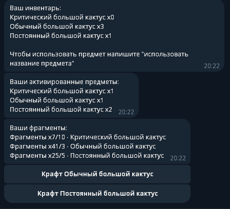
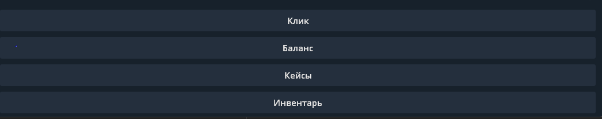

# Бот-Кликер на ТГ с системой инвентаря, крафтинга, кейсов итд
У бота есть интересные детали:
- Cистема открытия кейсов, с анимацией
- Полноценно работющий инвентарь для каждого пользователя
- Полноценно работающая система крафтинга из фрагментов получаемых из кейсов
- Возможность активировать предметы в инвентаре
- Дефолт кликер, почти как в хомячке, где ты крафтишь предметы-бустеры и поднимаешь свой доход

У бота много всего интересного. Код в некоторых местах НЕ-ЧИТАЕМЫЙ, простите ):
Легко добавить новый кейс/новые бустеры. 
Вкратце пробегусь по функциям:
- open_case() - функция при открытии кейса. Всегда открывает BaseCase. Чтобы добавить свой добавьте вторым аргументом кейс, и передавайте его. Функция все равно будет работать.
- craft() - крафт предметов из их фрагментов. Вызывается при нажатие на кнопки в инвентаре.
- write_inv_data() - показывает весь ваш инвентарь (фрагменты, активированные предметы, предметы)
- command_start_handler() - функция при команде /start
- echo_handler() - просто чекает все сообщения, и делает с ними что-то 0_0

По всем ошибкам/предложениям/заказам итд - писать в дискорд angrycat345
PS: перед началой работы ОБЯЗАТЕЛЬНО написать /start боту.
PSS: Создать бота и получить токен можно в BotFather в телеграмме

